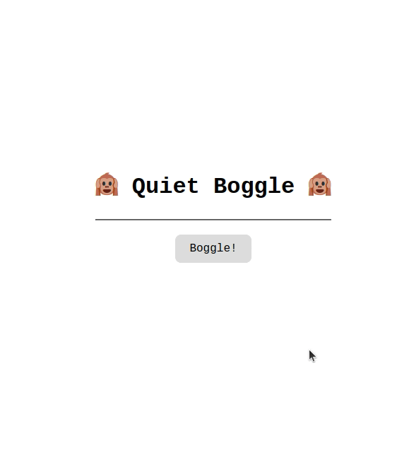

# Quiet Boggle



## Description

Quiet Boggle is a simple and quiet web-based version of the classic family board game "Boggle!", created using React and TypeScript. 

The game generates a 4x4 Boggle board with random letters on each cell based on the Boggle letter dice, and players have three minutes to find as many words as they can on the board.

## Features

- Randomly generated Boggle board.
- Countdown timer for a 3-minute game.
- Game over message when the time runs out.
- * Not yet optimized for mobile *

## Usage

To play the game, follow these steps:

1. Clone the repository to your local machine.
2. Open a terminal and navigate to the project directory.
3. Install the required dependencies with the following command:

   ```
   npm install
   ```

4. Start the development server:
```
npm run dev
```

5. Navigate to localhost:5173 in your browser.

## How to Play

1. Click the "Boggle!" button to start a new game.
2. The 4x4 Boggle board will be generated with random letters.
3. You (and your gamemates) have 3 minutes to find as many words as possible on the board.
4. After the round ends, a "Game Over" message will be displayed.


## Future Additions

- Mobile responsiveness
- Pathfinding algorithm to check words against the game board grid (checking validity)